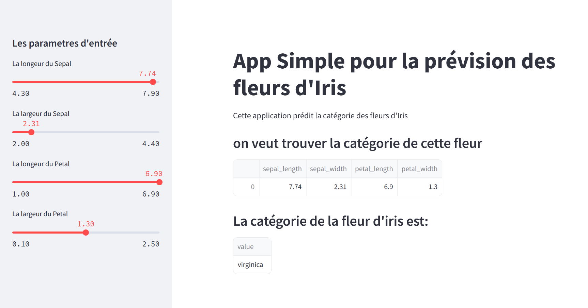

# App Simple pour la Prévision des Fleurs d'Iris 🌸

Cette application utilise l'algorithme **Random Forest** pour prédire la catégorie d'une fleur d'Iris en fonction de ses caractéristiques (longueur/largeur des sépales et pétales). Développée avec **Python** et **Streamlit**, elle permet une interaction facile via des curseurs.

---

## Fonctionnalités 🌟

- **Interface utilisateur intuitive** via des curseurs pour définir les paramètres de la fleur.
- **Prédictions en temps réel** grâce à un modèle entraîné.
- **Modèle Machine Learning** : RandomForestClassifier de `scikit-learn`.

---

## Capture d'Écran de l'Application 📸



---

## Installation et Utilisation 🛠️

### Pré-requis

Avant de commencer, assurez-vous d'avoir **Python 3.12.0** installé. Installez également les bibliothèques nécessaires avec la commande suivante :  
```bash
pip install streamlit pandas scikit-learn
```

### Étapes d'Exécution

1. **Clonez le dépôt** (si applicable) :
   ```bash
   git clone https://github.com/merouane-bn/iris-flower-prediction.git
   cd iris-flower-prediction
   ```

2. **(Optionnel)** Créez un environnement virtuel et activez-le :  
   ```bash
   python -m venv venv  
   source venv/bin/activate  # Sur Windows : `venv\Scripts\activate`
   ```

3. **Installez les dépendances** :  
   ```bash
   pip install streamlit pandas scikit-learn
   ```

4. **Lancez l'application** :  
   ```bash
   streamlit run app.py  # Remplacez `app.py` si le fichier porte un autre nom
   ```

---

## Comment Utiliser l'Application 🚀

1. Ajustez les **curseurs** dans la barre latérale pour entrer les paramètres de la fleur.
2. L’application affichera en temps réel la **catégorie de la fleur** (Setosa, Versicolour ou Virginica).
3. Les résultats s’affichent directement sur la page principale.

---

## Structure du Projet 📂

```
├── app.py               # Code principal de l'application Streamlit
├── README.md            # Documentation du projet
└── Capture             # capture d'écran de l'Application
```

---

## Auteurs ✍️

- **MEROUANE BENELABDY** - Développeur de l'application.

---

## Licence 📄

Ce projet est sous licence MIT - consultez le fichier [LICENSE](LICENSE) pour plus de détails.

---
